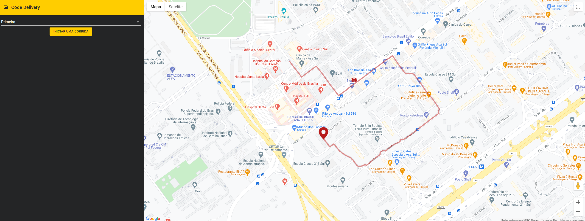

<h1 align="center">
    
</h1>

<p align="center">
  
</p>

## What is inside?

This project uses lot of stuff as:

- [Golang](https://golang.org/)
- [TypeScript](https://www.typescriptlang.org/)
- [NestJS](https://nestjs.com/)
- [Apache Kafka](https://kafka.apache.org/)
- [Docker](https://www.docker.com/)
- [Kubernetes](https://kubernetes.io/)
- [MongoDB](https://www.mongodb.com/)

## Getting Started

First, Configure /etc/hosts:

Add to your /etc/hosts (For Windows the path is  C:\Windows\system32\drivers\etc\hosts)
```
127.0.0.1 host.docker.internal
```
## Installation instructions are in the README.md of each project
---
## Development Mode
- [apache-kafka](https://github.com/MessiasJunio/real-time-delivery/tree/main/apache-kafka)
- [simulator](https://github.com/MessiasJunio/real-time-delivery/tree/main/simulator)
- [nest-api](https://github.com/MessiasJunio/real-time-delivery/tree/main/nest-api)
- [react-frontend](https://github.com/MessiasJunio/real-time-delivery/tree/main/nest-api)

## Production Mode
Deploy and scalability:
- [k8s](https://github.com/codeedu/imersao-fsfc2/tree/main/k8s)
---

## Learn More

### Deploy with Google Cloud and Kubernetes:

Deploying a containerized web application: https://cloud.google.com/kubernetes-engine/docs/tutorials/hello-app

